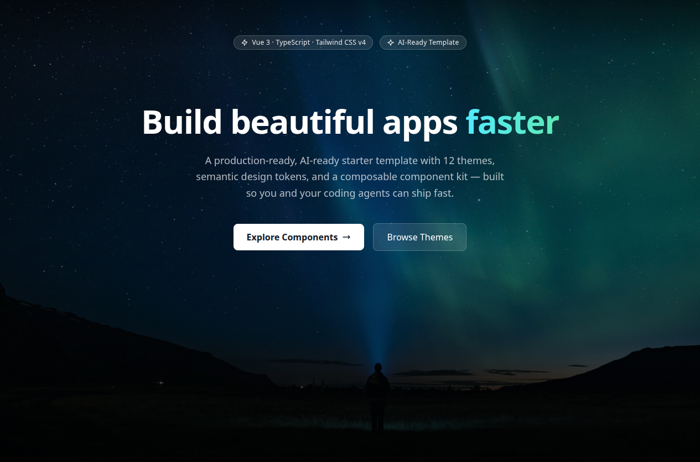

# Snowind Template

A ready-to-use [Vue 3](https://vuejs.org/) + [Tailwind CSS v4](https://tailwindcss.com/) template with multi-theme support and AI inference streaming. Part of the [Snowind](https://github.com/synw/snowind) project.



## Features

- ⚡ **Vue 3 + TypeScript** — built with the Composition API (`<script setup lang="ts">`)
- 🎨 **Multi-theme support** — 12 themes applied via CSS custom properties, switchable at runtime
- 🌗 **Tailwind CSS v4** — utility styling plus a semantic-colors layer (`prim`, `sec`, `ter`, `success`, `warning`, `danger`, `info`, …)
- 📱 **Mobile-responsive layout** — fixed header, collapsible mobile menu, scrollable content area, footer
- 🧭 **Client-side routing** — vue-router with dynamic imports and automatic document titles
- 🧩 **UI component kit** — a `Sw-*` design-system library (inputs, textarea, switch, popover, tooltip, tree, toast, notification, …)
- 🧠 **AI inference streaming** — real-time token streaming to markdown rendering via [Agent Smith](https://github.com/lynxai-team/agent-smith) and `markstream-vue`

## Documentation

### For AI Agents
- [Codebase Summary](.agents/documentation/codebase-summary.md) — Architecture, key files, and patterns (structured, machine-readable)
- [Project Overview](.agents/documentation/project-overview.md) — Concise project overview (~1 page)
- [Project Navigation](.agents/documentation/project-nav.md) — Detailed navigation map with dependency graph
- [Decision Tree](.agents/documentation/decision-tree.md) — Quick guide: find the right doc for your task
- [Colors Cheat Sheet](.agents/documentation/colors.md) — Tailwind semantic colors cheat sheet
- [CSS System Guide](.agents/documentation/css-system-guide.md) — Theming architecture, dark mode, and how to add new colors/themes

## Get Started

### 1. Clone the repo

```bash
git clone https://github.com/synw/snowind-template.git
cd snowind-template
```

### 2. Install dependencies

This project ships with a `package-lock.json`, so `npm` is the recommended package manager:

```bash
npm install
```

### 3. Run the dev server

```bash
npm run dev
```

Open <http://localhost:5173>. The app boots at `src/main.ts` and mounts the root layout in `src/App.vue`.

### 4. Build for production

```bash
npm run build
```

A static build is generated in `dist/`. Preview it locally with `npm run preview`.

## Adding a Page

Pages are Vue components registered as routes in [`src/router.ts`](src/router.ts). Each route sets the document title via `meta.title`.

1. Create a new view component, e.g. `src/views/AboutView.vue`:

   ```vue
   <template>
     <div class="container mx-auto">
       <h1 class="text-2xl prim">About</h1>
       <p>Your content here.</p>
     </div>
   </template>
   ```

2. Register it in `src/router.ts`:

   ```ts
   {
     path: "/about",
     component: () => import("./views/AboutView.vue"),
     meta: { title: "About" }
   }
   ```

That's it — the page is live at `/about` with its document title set automatically.

## Creating Components

Components follow the `<script setup lang="ts">` convention and are styled with Tailwind utility classes plus the semantic-color classes (`prim`, `sec`, `ter`, `success`, …) that recolor based on the active theme.

- **Layout components** live in [`src/components/`](src/components/) (header, footer, theme switcher, icons).
- **Page-level views** live in [`src/views/`](src/views/).
- The reusable `Sw-*` design-system kit lives in [`src/vibe/`](src/vibe/) — see the **Design System Kit** section below for a full component summary.

### Using the theme switcher

The active theme is persisted to `localStorage`. Switch themes programmatically from `src/state.ts`:

```ts
import { setTheme } from "@/state.js";

setTheme("forest"); // swaps the <html> class and recolors everything
```

Twelve themes are available (defined in [`src/conf.ts`](src/conf.ts)): `black`, `navy`, `forest`, `slate`, `royal`, `teal`, `pearl`, `sandstone`, `cloud`, `graphite` (default), `airy-soft`, and `stone`.

## Design System Kit components

The reusable design-system kit lives in [`src/vibe/`](src/vibe/). Every component uses `<script setup lang="ts">`, is styled with Tailwind semantic-color classes, and automatically recolors to match the active theme. Live, interactive demos of all components are available at `/components` ([`src/views/ComponentsView.vue`](src/views/ComponentsView.vue)).

### Available components

All paths below are relative to [`src/vibe/components/`](src/vibe/components/).

| Component | Path | Purpose | Key API |
|-----------|------|---------|---------|
| `SwInputText` | `inputtext/SwInputText.vue` | Single-line text input | `v-model` (string) |
| `SwInputNumber` | `inputnumber/SwInputNumber.vue` | Number field with optional +/- stepper buttons; clamps to `min`/`max` and snaps to `step`; ArrowUp/ArrowDown nudge, Enter commits, Escape reverts | `v-model` (`number \| null`, empty field emits `null`), `min`, `max`, `step`, `showButtons`, `buttonLayout` (`'vertical' \| 'horizontal'`), `size` (`'small' \| 'medium' \| 'large'`), `fluid`; also emits `valueChange` |
| `SwTextarea` | `textarea/SwTextarea.vue` | Multi-line input with optional auto-grow (no scrollbar) | `v-model` (string), `rows`, `autoResize` |
| `SwSwitch` | `switch/SwSwitch.vue` | Accessible toggle switch (`role="switch"`); default slot renders the label | `v-model` (boolean), `big`, `color` (any semantic color, default `success`) |
| `SwPopover` | `popover/SwPopover.vue` | Teleported overlay panel positioned below its trigger; flips above when near the viewport edge; closes on outside click or Escape | No props — call `show()` / `hide()` / `toggle()` via a template ref (exposed); emits `hide`; default slot holds the panel content |
| `SwTooltip` | `tooltip/SwTooltip.vue` | Lightweight hover/focus tooltip, no JS positioning | `text` (string), wraps its trigger in the default slot |
| `SwTree` | `tree/SwTree.vue` | Tree view with optional search filter (matched branches auto-expand), expand/collapse, single or multiple selection; scoped slot for custom node rendering (`#default="{ node }"`) | `nodes: SwTreeNode[]` (`{ key, label, children? }`), `filter`, `selectionMode` (`'single' \| 'multiple'`), `v-model:expandedKeys`; emits `nodeSelect(node)` |
| `SwListbox` | `listbox/SwListbox.vue` | Selectable listbox with optional filter input, full keyboard navigation (arrow keys, Home/End, Enter/Space) and roving tabindex; selecting the current option clears it | `options` (strings or objects), `v-model`, `optionLabel` (default `'label'`), `filter`, `focused` (auto-focus when visible) |
| `SwIftaLabel` | `iftalabel/SwIftaLabel.vue` | Floating label overlay for form controls | `label` (string), optional `labelFor`; wraps the control in the default slot |
| `SwToast` / `SwToastItem` | `toast/` | Toast notification stack with auto-dismiss (1.5 s default) | Global composable: `toast.success(msg)`, `toast.warning(msg)`, `toast.error(msg)`, `toast.info(msg)`; `toasts` ref + `remove(id)` |
| `SwNotification` / `SwNotificationItem` | `notification/` | Notification center with severity levels (`info`, `success`, `warn`, `error`) and per-item lifetime | Global composable: `addNotification({ severity, title, detail?, life })`, `removeNotification(id)`, `notifications` ref |
| `SwConfirmDialog` | `confirm/` | Modal confirmation dialog driven by a composable (Promise-based accept/reject) | `requireConfirmation({ title, message, accept, reject? })`, `closeConfirmation()`, `confirmation` ref |

### Quick usage

Import components directly from their files with the `@/` alias:

```vue
<script setup lang="ts">
import { ref } from "vue";
import SwInputText from "@/vibe/components/inputtext/SwInputText.vue";
import SwSwitch from "@/vibe/components/switch/SwSwitch.vue";
import { toast } from "@/vibe/components/toast/composable.js";

const name = ref("");
const enabled = ref(false);
</script>

<template>
  <SwInputText v-model="name" />
  <SwSwitch v-model="enabled">Enable feature</SwSwitch>
  <button @click="toast.success('Saved!')">Save</button>
</template>
```

### Mounting the global hosts

The app-level components are already wired up in [`src/App.vue`](src/App.vue):

- `<SwToast :toasts="toasts" />` — renders toasts for the global `toast.*()` API
- `<SwNotification />` — renders the notification center fed by `addNotification()`

`SwConfirmDialog` is not mounted globally — mount it once where you use confirmations (see how [`src/views/ComponentsView.vue`](src/views/ComponentsView.vue) does it), then trigger dialogs with `requireConfirmation()`:

```ts
import { requireConfirmation } from "@/vibe/components/confirm/composable.js";

await requireConfirmation({
  title: "Delete item?",
  message: "This action cannot be undone.",
  accept: async () => { /* perform the delete */ },
});
```

## Theming

Each theme lives in its own SCSS file under [`src/scss/`](src/scss/) and defines CSS custom properties for both light and dark variants. The active theme is toggled by applying a `theme-<name>` class on the `<html>` element, and the semantic-color Tailwind classes automatically adapt to whichever theme is active — so your components stay consistent across themes without extra work.

## Important Notes

- **Runtime**: Node.js 18+ is recommended (Vite + ESM). Requires a browser to run.
- **Module system**: ESM only (`"type": "module"`). The `@/` path alias resolves to `/src/`.
- **Private template**: `snowind-template` is marked `private` in `package.json` and is not published to any registry.
- **Build tooling**: `npm run buildserver` compiles the TypeScript server entry (`tsconfig_bin.json`); `npm run server` runs it in watch mode, `npm run local` runs the compiled `dist/bin/index.js`.

## License

This project is licensed under the [MIT License](LICENSE) — Copyright (c) 2022 synw.
